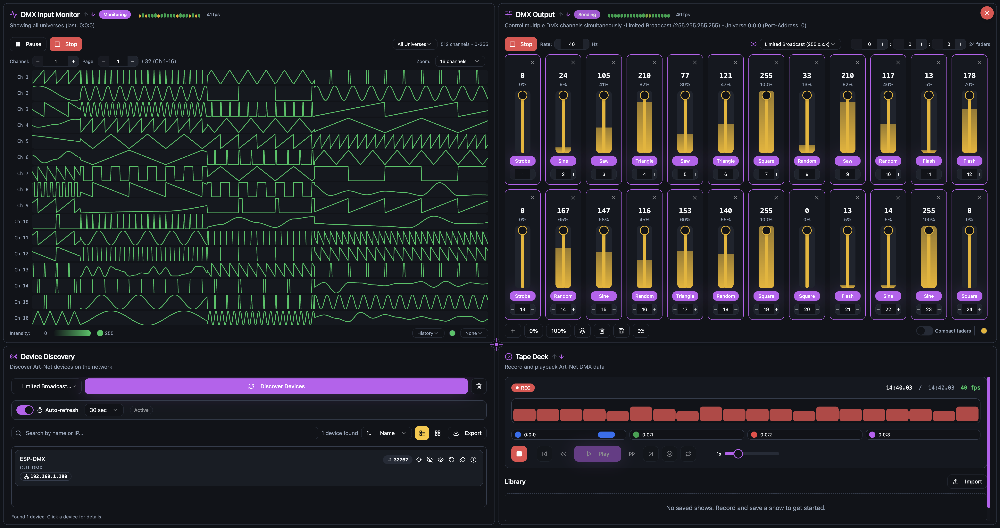

# Art-Net Tune

**See Your Network. Test Your Universe.**

A powerful web-based application for discovering, configuring, monitoring and testing Art-Net DMX lighting devices on your network.

🌐 **Live App**: [https://alf45tar.github.io/ArtNetTune/](https://alf45tar.github.io/ArtNetTune/)

---

## 🎯 Overview

Art-NetTune is a browser-based tool that allows lighting designers, technicians, and system integrators to:

- **Discover** Art-Net nodes on the network
- **Configure** Art-Net devices remotely
- **Monitor** network activity in real-time
- **Record** Art-Net data from multiple universes
- **Playback** recorded shows with timeline control
- **Test** DMX universes by sending test patterns
- **Control** lighting fixtures without dedicated software

The application runs entirely in the browser - no installation required!

---

## ✨ Features

### Network Discovery

- Automatic Art-Net node discovery via ArtPoll
- Real-time device status monitoring
- Display of node information (IP, port, firmware, etc.)
- **Search in device list** to quickly find specific devices
- **Export device list** to CSV or JSON format

### Device Configuration

- Remote device configuration
- Universe/subnet/net addressing
- Network settings (IP, subnet mask, gateway, DHCP)
- Node naming and identification
- Short and long name assignment
- LED control (mute, normal, locate)
- Clear output functionality
- Cancel merge operations

### DMX Input Monitor

- **Real-time monitoring** of incoming DMX data from all universes
- **Live channel display** showing current values for all 512 channels
- **Activity indicators** to visualize data flow
- **Universe filtering** to focus on specific universes
- **Data logging** of incoming Art-Net packets
- **Performance metrics** including refresh rate and packet count
- **Multiple visualization types**:
  - **Block** - Grid-based channel visualization
  - **Bar** - Bar chart showing channel values
  - **Pie** - One pie chart per channel
  - **History** - Time-series graph of channel changes
- **Channel value display modes**:
  - **0-255** - Display DMX values in full range (0 to 255)
  - **0-100%** - Display DMX values as percentages (0% to 100%)

### DMX Output

- Send Art-Net DMX packets to any universe
- Real-time channel control
- Multiple test patterns:
  - All channels at maximum (255)
  - All channels at 0%
  - Automatic signal generation patterns (configurable from 0.1 Hz to 10 Hz):
    - Sine wave
    - Sawtooth wave
    - Triangle wave
    - Square wave
    - Flash strobe
    - Random values
  - Custom channel values

### Recording & Playback

- **Record** live Art-Net data from all universes simultaneously
- **Multi-universe recording** captures data from multiple universes at once
- **Timeline playback** with visual progress indicator
- **Playback controls**: Play, Pause, Stop, Skip, Speed control
- **Universe selection** for recording and playback
- **Trim head and tail** of recorded shows to remove unwanted sections
- **Save recordings** as show files for later use
- **Load shows** to replay saved recordings
- **Download show** files to your computer
- **Import show** to load previously downloaded files
- **Export show** to multiple formats for use in other applications
- **FPS monitoring** during recording and playback
- Perfect for show documentation and testing

---

## 🚀 Getting Started

### Using the Live App

1. **Set up a UDP-to-WebSocket bridge** on your network (required for Art-Net communication)
   - Download and run the bridge from: [https://github.com/alf45tar/udp-ws-bridge](https://github.com/alf45tar/udp-ws-bridge)
2. **Open the app** in your web browser: [https://alf45tar.github.io/ArtNetTune/](https://alf45tar.github.io/ArtNetTune/)
3. **The app will automatically connect** to the bridge
4. **Ensure your device is on the same network** as your Art-Net nodes
5. **Allow firewall permissions** if prompted
6. Start discovering and configuring devices!

### Browser Requirements

- Modern web browser:
  - Chrome
  - Edge
  - Firefox

**Note for Firefox users**: If experiencing issues, disable enhanced tracking protection for this site.

**⚠️ Safari is NOT supported** due to limited WebSocket restrictions that prevents proper communication with the UDP-to-WebSocket bridge, which is essential for Art-Net functionality. Please use Chrome, Edge, or Firefox instead.

### Network Requirements

- Your computer must be on the same network as Art-Net devices
- Art-Net uses port **6454** (UDP)
- **UDP-to-WebSocket bridge** is required: [https://github.com/alf45tar/udp-ws-bridge](https://github.com/alf45tar/udp-ws-bridge)
- Firewall must allow required ports

---

## 🔧 Technical Details

### Architecture

Since web browsers cannot directly send UDP packets, Art-NetTune uses a **UDP-to-WebSocket bridge** to communicate with Art-Net devices:

1. **Browser** → **Bridge Server**
2. **Bridge Server** → **Art-Net Devices** (UDP port 6454)
3. **Art-Net Devices** → **Bridge Server** → **Browser**

The bridge server acts as a translator between the web browser and Art-Net devices.

**Bridge Software**: [https://github.com/alf45tar/udp-ws-bridge](https://github.com/alf45tar/udp-ws-bridge)

### Protocol Supported

#### Art-Net

- **Version**: Art-Net 4
- **Port**: UDP 6454
- **Addressing**: Net (0-127), Subnet (0-15), Universe (0-15)
- **Total Universes**: 32,768
- **Packet Types**:
  - ArtPoll: Device discovery
  - ArtPollReply: Device information
  - ArtDmx: DMX data transmission
  - ArtAddress: Address configuration
  - ArtCommand: Device commands
  - ArtIpProg: Remote IP configuration
  - ArtIpProgReply: IP configuration response
- **Channels**: 512 per universe

---

## 📚 Resources

### Official Specifications

- [Art-Net 4 Specification](https://www.artisticlicence.com/WebSiteMaster/User%20Guides/art-net.pdf)
- [DMX512-A Standard](https://tsp.esta.org/tsp/documents/published_docs.php)

---

## 🎭 Use Cases

### Lighting Design

- Test universe patching during setup
- Verify fixture addressing
- Quick troubleshooting
- Demo/presentation mode
- **Record and document lighting cues**
- **Play back shows for client review**

### System Integration

- Commission new installations
- Network diagnostics
- Remote configuration
- Documentation of setups
- **Record baseline shows for comparison**
- **Replay test sequences**

### Education

- Learn Art-Net protocol
- Understand DMX addressing
- Practice lighting control
- Network training
- **Record and analyze lighting patterns**
- **Study timing and synchronization**

---

*See Your Network. Test Your Universe.*
